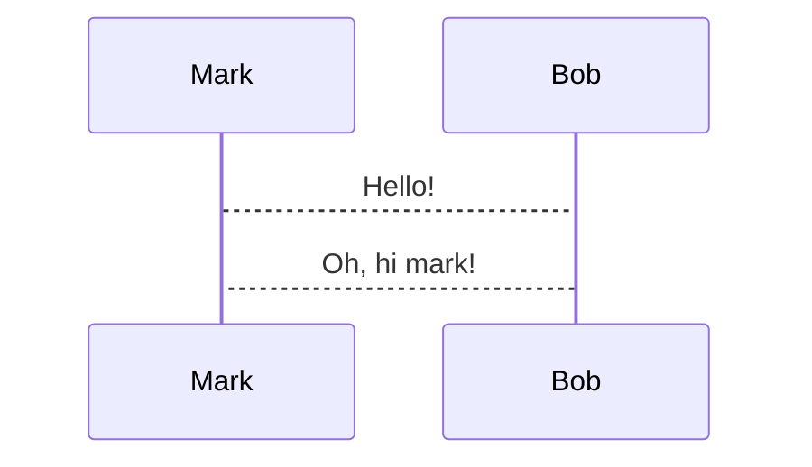

# Code Snippets

Code blocks are annotated by appending flags after the language: `+line_numbers`, `+exec`, `+render`, etc. Multiple flags compose, e.g. ```` ```bash +exec +line_numbers ````.

## Snippet flag summary

| Flag | Effect |
| --- | --- |
| `+line_numbers` | Show line numbers on the left |
| `+exec` | Executable via `ctrl+e` (requires `-x` or config opt-in) |
| `+exec:<executor>` | Execute with an alternative executor (e.g. `rust-script`) |
| `+auto_exec` | Like `+exec` but runs without pressing `ctrl+e` |
| `+exec_replace` | Auto-execute and replace the snippet with its output (requires `-X` or config opt-in) |
| `+image` | Like `+exec_replace` but output must be a jpg/png image, rendered as such |
| `+id:<name>` | Name the snippet so `<!-- snippet_output: name -->` can place its output elsewhere |
| `+pty` | Run in a pseudo terminal (for `top`-style TUIs); `+pty:<cols>:<rows>` sets size |
| `+pty:standby` | Keep the PTY area visible before execution; `+pty:standby:<cols>:<rows>` also sets size |
| `+acquire_terminal` | With `+exec`: suspend presenterm and hand the raw terminal to the program |
| `+validate` | Not executable, but run when `--validate-snippets` is passed |
| `+expect:failure` | With validation: error if the snippet does NOT fail |
| `+render` | Pre-render mermaid/latex/typst/d2 blocks into images |
| `+width:<n>%` | Width of a `+render` image as a percentage of the terminal |
| `+no_background` | Render the snippet without a background (pairs well with `+exec_replace`) |

## Supported languages

Highlighting is supported for: ada, asp, awk, bash, cmd, C, cmake, crontab, C#, clojure, C++, CSS, D, dart, diff, docker, dotenv, elixir, elm, erlang, fish, F#, gdscript, go, graphql, haskell, HTML, java, javascript, json, jsonnet, julia, kotlin, latex, lua, makefile, markdown, nix, ocaml, perl, php, powershell, protobuf, puppet, python, R, racket, ruby, rust, scala, shell, sql, swift, svelte, tcl, toml, terraform, typescript, tsx, verilog, vue, wsl, xml, yaml, zig, zsh.

Execution (`+exec`) is supported for: bash, cmd, C, C#, C++, elixir, fish, F#, go, haskell, java, javascript, jsonnet, julia, kotlin, lua, perl, php, powershell, python, R, ruby, rust, shell, typescript, tsx, wsl, zsh. nushell supports execution but not highlighting.

Custom executors for other languages can be configured in the config file (see [configuration.md](configuration.md)). Highlighting syntaxes come from [bat](https://github.com/sharkdp/bat); languages bat supports can be added to presenterm.

## Line numbers

~~~markdown
```rust +line_numbers
fn hello_world() {
    println!("Hello world");
}
```
~~~

The `code.line_numbers` theme key enables line numbers for all snippets.

## Selective highlighting

Highlight only certain lines with braces containing individual lines or ranges:

~~~markdown
```rust {1,3,5-7}
   fn potato() -> u32 {         // 1: highlighted
                                // 2: not highlighted
       println!("Hello world"); // 3: highlighted
       let mut q = 42;          // 4: not highlighted
       q = q * 1337;            // 5: highlighted
       q                        // 6: highlighted
   }                            // 7: highlighted
```
~~~

## Dynamic highlighting

The `|` separator advances the highlighted set on each next/previous keypress. Use `all` for a frame that highlights everything:

~~~markdown
```rust {1,3|5-7|all}
   fn potato() -> u32 {

       println!("Hello world");
       let mut q = 42;
       q = q * 1337;
       q
   }
```
~~~

Lines 1 and 3 are highlighted first; advancing switches to lines 5-7, then to all lines.

## Including external code files

The `file` snippet type includes an external file, highlighted as the given language. `start_line` / `end_line` select a subset:

~~~markdown
```file +exec +line_numbers
path: snippet.rs
language: rust
start_line: 5
end_line: 10
```
~~~

# Snippet Execution

Annotating a block with `+exec` makes it executable: pressing `ctrl+e` on the slide runs it and displays the output in a box below. Execution is stateful across slide changes.

Execution **must be explicitly enabled** via either:

- The `-x` / `--enable-snippet-execution` CLI flag.
- `snippet.exec.enable: true` in the config file.

Run code in presentations at your own risk, especially someone else's presentation. Don't blindly enable snippet execution.

## Output placing

By default output appears right below the snippet. To place it elsewhere (another column, a later slide), give the snippet an id and reference it:

~~~markdown
```bash +exec +id:foo
echo hello world
```
~~~

```html
<!-- snippet_output: foo -->
```

A snippet can be referenced multiple times in slides at or after the one defining it; it executes once and every reference shows that execution's output.

## Validating snippets

`--validate-snippets` runs all `+exec`, `+exec_replace`, and `+validate` snippets at startup (and re-runs on reload), reporting an error for any non-zero exit code. `+validate` marks a snippet for validation without making it executable. `+expect:failure` inverts the check: error if the snippet succeeds.

## PTY execution

`+pty` runs the snippet in a pseudo terminal so cursor-moving/screen-clearing tools (`top`, `htop`) behave correctly. Works with any language. The PTY expands to fit the screen; `+pty:80:30` sets a custom size. `+pty:standby` keeps the output area visible before execution (`+pty:standby:<cols>:<rows>` to also size it). Sending keyboard input into running scripts is not supported.

For programs that need the real TTY, combine `+exec +acquire_terminal`: presenterm suspends, the program gets the raw terminal, and presenterm resumes when it exits.

## Executing and replacing

`+exec_replace` executes automatically without user intervention and replaces the snippet with its output. Useful for dynamically generated ASCII art, or piping a file through `bat --color always` for languages presenterm can't highlight. Because of the risk, it requires separate opt-in: the `-X` / `--enable-snippet-execution-replace` flag or `snippet.exec_replace.enable: true` in config.

`+auto_exec` behaves like `+exec` without requiring `ctrl+e`.

`+image` behaves like `+exec_replace` but treats the output as an image; the code must emit only a jpg/png image to stdout. Same opt-in flags as `+exec_replace`.

## Alternative executors

Specify `:<executor-name>` after `+exec` / `+exec_replace`:

- `rust-script` for rust (allows external crates via cargo manifest comments).
- `pytest` and `uv` for python.

~~~markdown
```rust +exec:rust-script
# //! ```cargo
# //! [dependencies]
# //! time = "0.1.25"
# //! ```
fn main() {
    println!("the time is {}", time::now().rfc822z());
}
```
~~~

## Styled execution output

Output containing ANSI color/style escape codes is rendered with those styles. Tools often disable color when not on a TTY, so force it, e.g. `ls /tmp --color=always`.

## Hiding code lines

Lines starting with a per-language prefix are executed but not displayed. Useful for hiding imports, boilerplate `main` functions, etc:

~~~markdown
```rust
# fn main() {
println!("Hello world!");
# }
```
~~~

Prefixes: rust uses `# `; python/bash/fish/shell/zsh/kotlin/java/javascript/typescript/c/c++/go use `/// `.

# Pre-rendered Blocks (+render)

`mermaid`, `latex`, `typst`, and `d2` blocks with the `+render` attribute are converted into images when the presentation loads. The `auto_render_languages` option can make `+render` implicit for chosen languages (commonly mermaid).

Rendering happens asynchronously on a thread pool (`snippet.render.threads`, default 2).

## Mermaid

Requires [mermaid-cli](https://github.com/mermaid-js/mermaid-cli) (`mmdc`). Slow-ish (~2s per image) since it spins up a browser.

~~~markdown

~~~

Sizing: prefer tuning the `mermaid.scale` config parameter until images look big enough, then adjust individual images with `+width:<n>%`. A small scale blown up via `+width` gets blurry. Theme keys `mermaid.background` and `mermaid.theme` control colors.

## LaTeX and typst

Both render via [typst](https://github.com/typst/typst); latex additionally requires [pandoc](https://github.com/jgm/pandoc) (latex is converted to typst, then rendered).

~~~markdown
```latex +render
\[ \sum_{n=1}^{\infty} 2^{-n} = 1 \]
```
~~~

- Generated image size is controlled by `typst.ppi` in the config file (default 300) and per-snippet `+width:<n>%`.
- Theme keys: `typst.colors.background/foreground`, `typst.horizontal_margin`, `typst.vertical_margin` (in points).
- Images inside typst snippets must use absolute paths (`#image("/image1.png")`) which resolve relative to the presentation's directory, and must live at or below that directory.

## D2

Requires [d2](https://github.com/terrastruct/d2). Scaled via `+width:<n>%` or the `d2.scale` config property (passed to the d2 CLI's `--scale`). The `d2.theme` theme parameter selects a d2 theme.

~~~markdown
```d2 +render
my_table: {
  shape: sql_table
  id: int {constraint: primary_key}
}
```
~~~
